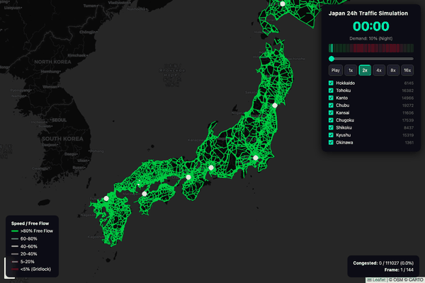

```
 █████╗      ██╗████████╗ ██████╗
██╔══██╗     ██║╚══██╔══╝██╔════╝
███████║     ██║   ██║   ██║  ███╗
██╔══██║██   ██║   ██║   ██║   ██║
██║  ██║╚█████╔╝   ██║   ╚██████╔╝
╚═╝  ╚═╝ ╚════╝    ╚═╝    ╚═════╝
```

# All-Japan Traffic Grid Simulation

UXsim-based mesoscopic traffic simulation covering 9 regions of Japan, with animated 24-hour visualization on interactive Folium/Leaflet maps.

> 日本全国9地域の道路交通メソスコピックシミュレーション。24時間アニメーション付きインタラクティブ地図で可視化。



*24-hour traffic simulation across 9 regions of Japan (111,027 road links). Colors indicate speed relative to free-flow: green = free flow, red = congested.*

---

## Visualizations (`visualize/`)

| Script | Output | Description |
|--------|--------|-------------|
| `japan_road_network.py` | Static HTML map | Road network visualization using Folium. Renders OSM-extracted road segments by type (高速道路〜県道). |
| `japan_traffic_heatmap.py` | Heatmap HTML | Traffic density heatmap built from OpenStreetMap road data. |
| `japan_traffic_uxsim.py` | Static HTML map | UXsim simulation results rendered as a static congestion map. |
| `japan_traffic_animated.py` | Animated HTML | **Main output.** 24-hour animated simulation with per-region toggle checkboxes. Time-slider controls playback across all 9 regions. |

All outputs are written to `visualize/output/`.

---

## Quick Start

### 1. Set up environment

```bash
cd visualize
python3 -m venv .venv
source .venv/bin/activate
pip install -r ../requirements.txt
```

### 2. Run a visualization

```bash
# Animated 24h simulation (main visualization / メインの可視化)
python japan_traffic_animated.py

# Static road network map
python japan_road_network.py

# Traffic density heatmap
python japan_traffic_heatmap.py

# Static UXsim results
python japan_traffic_uxsim.py
```

Outputs are saved to `visualize/output/`. Open the `.html` files in a browser.

---

## Tech Stack

- **Python 3.14**
- **UXsim** -- mesoscopic traffic simulation (platoon-based)
- **osmnx** -- OpenStreetMap road network extraction
- **Folium / Leaflet** -- interactive map rendering
- **NetworkX** -- graph construction and analysis

---

## Related Project

[`japan-traffic-flow-data`](../japan-traffic-flow-data/) -- Traffic flow data platform for integrating real observed data (交通量常時観測データ) into the simulation pipeline.

---

## Project Structure

```
visualize/
├── japan_road_network.py      # Static road network map (Folium)
├── japan_traffic_heatmap.py   # Traffic density heatmap from OSM
├── japan_traffic_uxsim.py     # Static UXsim simulation results
├── japan_traffic_animated.py  # 24h animated simulation (main)
└── output/                    # Generated HTML visualizations
    ├── index.html             # Portal page (GitHub Pages top)
    ├── japan_traffic_animated.html
    ├── japan_traffic_heatmap.html
    ├── japan_traffic_uxsim.html
    └── ...

src/                           # Core library (network, simulation, viz)
scripts/                       # CLI entry points
web/                           # SimCity-style deck.gl viewer (MATSim)
```

---

## License

MIT

## Data Source

Road network data from [OpenStreetMap](https://www.openstreetmap.org/) (© OpenStreetMap contributors, ODbL).
